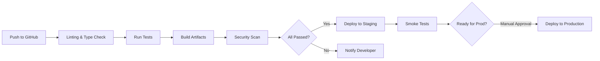

# 📋 PitWall Project Plan

## Executive Summary

PitWall is a comprehensive simracing telemetry ecosystem consisting of three integrated components:

1. **Telemetry Bridge** (Windows C# Service) - Multi-sim data normalization
2. **Frontend** (React Native + Web) - Real-time HUD and strategy tools
3. **Backend** (Node.js + PostgreSQL) - Analytics and data persistence

This document outlines the development roadmap, technical standards, architectural decisions, and feature breakdown.

---

## Table of Contents

- [Development Phases](#development-phases)
- [Phase Breakdown](#phase-breakdown)
- [Technical Standards](#technical-standards)
- [Architecture Decisions](#architecture-decisions)
- [Dependency Matrix](#dependency-matrix)
- [Testing Strategy](#testing-strategy)
- [Deployment & DevOps](#deployment--devops)
- [Risk Assessment](#risk-assessment)
- [Success Metrics](#success-metrics)

---

## Development Phases

### Phase 1: Telemetry Engine ⚙️
**Target: Q2 2026 (Weeks 1-8)**

The foundation - build a robust data bridge that normalizes telemetry from multiple racing sims into a unified JSON schema with sub-20ms latency.

**Deliverables:**
- ✅ Windows background service (C#, .NET 8.0)
- ✅ UDP listener for iRacing
- ✅ API connector for ACC (Assetto Corsa Competizione)
- ✅ UDP listener for Assetto Corsa
- ✅ API connector for F1 24/25
- ✅ Unified JSON telemetry schema
- ✅ WebSocket server for real-time streaming
- ✅ Connection health monitoring
- ✅ Unit tests (NUnit, 80%+ coverage)
- ✅ Documentation and deployment guide

**Key Metrics:**
- Latency: < 20ms (average)
- Uptime: 99.5%
- Supported Games: 4 (iRacing, ACC, AC, F1)
- Test Coverage: 80%+

### Phase 2: Live Race Engineer 🎯
**Target: Q3 2026 (Weeks 9-16)**

The intelligent co-pilot - real-time telemetry visualization, fuel management, and voice notifications.

**Deliverables:**
- ✅ React Native client (iOS, Android, Web)
- ✅ Smart Dashboard HUD
  - Gear/Speed display
  - Throttle/Brake visualization
  - Delta tracking (vs. best/session average)
- ✅ Tire temperature monitoring (inner/middle/outer)
- ✅ Fuel strategy calculator
  - Consumption tracking per lap
  - "Fuel to End" predictions
  - Safety margin alerts
- ✅ Voice notification system
  - Real-time callouts ("Car left", "Leader pitted", etc.)
  - TTS engine integration
  - Custom notification options
- ✅ Redux state management
- ✅ Real-time WebSocket integration
- ✅ Unit tests (Jest, 70%+ coverage)
- ✅ Documentation and user guide

**Key Metrics:**
- Update frequency: 60 FPS (desktop), 30 FPS (mobile)
- Feature completeness: 100% of initial design
- User experience score: > 4/5 stars

### Phase 3: Post-Session Analytics 📊
**Target: Q4 2026 (Weeks 17-24)**

The coach - analyze historical data and provide AI-powered insights.

**Deliverables:**
- ✅ Backend telemetry storage (PostgreSQL)
- ✅ Telemetry overlay visualization
  - Lap-to-lap comparison graphs
  - Throttle/brake trace analysis
  - Speed and acceleration overlays
- ✅ AI-powered debrief system
  - LLM integration (OpenAI/Claude API)
  - Automatic analysis of telemetry JSON
  - 3 actionable bullet points per session
- ✅ Stint tracker
  - Historical tire wear tracking
  - Fuel usage patterns
  - Pit stop recommendations
  - Degradation curve analysis
- ✅ Performance scoring system
- ✅ REST API for analytics
- ✅ Unit tests (Jest, 80%+ coverage)
- ✅ Integration tests

**Key Metrics:**
- Analysis generation time: 5-10 seconds
- LLM accuracy: > 85% relevant insights
- Data retention: 2 years minimum

### Phase 4: Ecosystem & Hardware ⚙️
**Target: Q1 2027 (Weeks 25-32)**

Enhanced ecosystem - setup library, hardware tracking, and collaboration features.

**Deliverables:**
- ✅ Cloud-synced setup library
  - Support for .sto (ACC) and .json formats
  - Tag system (Qualifying, Race, High Downforce, etc.)
  - Shareable setups with user permissions
- ✅ Hardware health tracker
  - Rotation hour logging (wheelbase)
  - Switcher click counter
  - Maintenance reminders
  - Component wear predictions
- ✅ Multi-user support
  - User authentication and authorization
  - Profile management
  - Usage statistics
- ✅ Team collaboration features
  - Shared telemetry storage
  - Team leaderboards
  - Role-based access control (RBAC)
- ✅ Admin dashboard
- ✅ Comprehensive documentation

**Key Metrics:**
- Setup library searchability: < 500ms
- Hardware tracking accuracy: > 98%
- Team features adoption: > 40% of user base

---

## Phase Breakdown

### Phase 1: Telemetry Engine

#### Week 1-2: Project Setup & Architecture
- [ ] Initialize Git repository
- [ ] Create project structure for all components
- [ ] Setup CI/CD pipelines
- [ ] Create documentation baseline
- [ ] .NET project scaffolding

**Deliverable:** GitHub repo with folder structure, .gitignore, workflows

#### Week 2-3: Core Telemetry Models
- [ ] Design unified telemetry schema (JSON)
- [ ] Create .NET data models
- [ ] Implement serialization/deserialization
- [ ] Create unit tests
- [ ] Documentation

**Schema Overview:**
```json
{
  "timestamp": 1712577600000,
  "session": {
    "id": "session-123",
    "name": "Qualifying",
    "type": "q",
    "track": "Monza",
    "game": "iRacing",
    "duration_seconds": 1800
  },
  "vehicle": {
    "gear": 4,
    "rpm": 12500,
    "speed_kmh": 285.5,
    "fuel_liters": 45.2,
    "fuel_consumed_this_lap": 1.8,
    "distance_this_lap_m": 5793.4
  },
  "inputs": {
    "throttle": 1.0,
    "brake": 0.0,
    "steering_angle": 0.15
  },
  "tires": {
    "fl": { "temp_c": [82, 85, 88], "wear_pct": 25 },
    "fr": { "temp_c": [83, 86, 89], "wear_pct": 24 },
    "rl": { "temp_c": [81, 84, 87], "wear_pct": 27 },
    "rr": { "temp_c": [82, 85, 88], "wear_pct": 26 }
  },
  "performance": {
    "delta_to_best": -0.125,
    "delta_to_session_avg": -0.050,
    "num_laps": 12,
    "current_lap_time": 120.456
  },
  "environment": {
    "air_temp_c": 22,
    "track_temp_c": 35,
    "weather": "dry",
    "track_grip": 1.0
  }
}
```

#### Week 3-4: iRacing UDP Implementation
- [ ] Implement iRacing UDP parser
- [ ] Map iRacing telemetry to schema
- [ ] Handle connection loss and reconnection
- [ ] Unit tests
- [ ] Performance optimization (< 5ms parsing)

#### Week 4-5: ACC & Assetto Corsa Implementation
- [ ] ACC API implementation
- [ ] AC UDP implementation
- [ ] Schema mapping for both
- [ ] Multi-game state management
- [ ] Unit tests

#### Week 5-6: F1 24/25 Implementation
- [ ] F1 24 API research and integration
- [ ] F1 25 API preparation (if available)
- [ ] Schema mapping
- [ ] Unit tests

#### Week 6-7: WebSocket Server & Integration
- [ ] Implement WebSocket server (.NET)
- [ ] Connection management
- [ ] Broadcast system
- [ ] Authentication tokens
- [ ] Integration tests

#### Week 7-8: Testing, Polish, Documentation
- [ ] Comprehensive unit tests (80%+ coverage)
- [ ] Integration tests
- [ ] Performance profiling
- [ ] Documentation
- [ ] Release version 1.0.0

**Acceptance Criteria:**
- ✅ All telemetry sources working
- ✅ Latency < 20ms average
- ✅ 80%+ test coverage
- ✅ Zero data loss during normal operation
- ✅ Graceful error handling with reconnection

---

### Phase 2: Live Race Engineer

#### Week 9-10: Frontend Setup & Components
- [ ] React Native project structure
- [ ] TypeScript configuration (strict mode)
- [ ] Redux setup with Redux Toolkit
- [ ] Component library creation
- [ ] Navigation setup (React Navigation)

#### Week 10-11: Dashboard HUD
- [ ] Core dashboard layout
- [ ] Gear display component
- [ ] Speed gauge with delta overlay
- [ ] Throttle/brake bar visualization
- [ ] Real-time update handling

#### Week 11-12: Tire Monitoring & Advanced Telemetry
- [ ] Tire temperature visualization
- [ ] Tire wear indicators
- [ ] Tire health scoring
- [ ] Alert system for tire issues
- [ ] Mobile responsive design

#### Week 12-13: Fuel Strategy Calculator
- [ ] Consumption tracking logic
- [ ] "Fuel to End" calculation
- [ ] Safety margin warnings
- [ ] Consumption graph visualization
- [ ] Historical tracking

#### Week 13-14: Voice Notifications
- [ ] TTS engine integration
- [ ] Notification system
- [ ] Custom callout options
- [ ] Volume and language settings
- [ ] Testing with accessibility tools

#### Week 14-15: WebSocket Integration & State Management
- [ ] Connect to Telemetry Bridge WebSocket
- [ ] Redux actions for telemetry updates
- [ ] Error handling and reconnection
- [ ] Performance optimization (Redux Reselect)
- [ ] Battery optimization

#### Week 15-16: Testing, Polish, Documentation
- [ ] Jest unit tests (70%+ coverage)
- [ ] E2E testing with Detox
- [ ] Performance profiling
- [ ] Accessibility audit (WCAG 2.1 AA)
- [ ] Documentation and user guide
- [ ] Release version 1.0.0-alpha

**Acceptance Criteria:**
- ✅ Dashboard FPS: 60 (desktop), 30+ (mobile)
- ✅ Data accuracy: ±2% vs telemetry source
- ✅ Notifications: 50-200ms latency
- ✅ 70%+ test coverage
- ✅ Works iOS 13+, Android 10+

---

### Phase 3: Post-Session Analytics

#### Week 17-18: Backend Setup & Database
- [ ] Node.js project structure
- [ ] PostgreSQL schema design
- [ ] Prisma ORM setup
- [ ] Database migrations
- [ ] Authentication middleware

#### Week 18-19: Telemetry Storage & Retrieval
- [ ] Telemetry ingestion API
- [ ] Data validation and normalization
- [ ] Query optimization (indexes)
- [ ] Data compression for storage
- [ ] API documentation

#### Week 19-20: Telemetry Overlay & Visualization
- [ ] Lap comparison data model
- [ ] GraphQL/REST API for telemetry
- [ ] Frontend visualization components
- [ ] Performance optimization (chunked data)
- [ ] Unit and integration tests

#### Week 20-21: AI-Powered Debrief
- [ ] LLM integration (OpenAI/Claude)
- [ ] Telemetry analysis prompts
- [ ] Insight generation pipeline
- [ ] Caching for performance
- [ ] Cost optimization

#### Week 21-22: Stint Tracker & Recommendations
- [ ] Stint data model
- [ ] Tire degradation tracking
- [ ] Fuel usage patterns
- [ ] Pit stop optimization engine
- [ ] Predictive models

#### Week 22-23: Performance & Scoring System
- [ ] Performance scoring algorithm
- [ ] Consistency metrics
- [ ] Improvement tracking
- [ ] Historical comparisons
- [ ] Leaderboard system

#### Week 23-24: Testing, Integration, Documentation
- [ ] Jest unit tests (80%+ coverage)
- [ ] Integration tests with database
- [ ] Load testing (1000 concurrent connections)
- [ ] API documentation (OpenAPI/Swagger)
- [ ] Release version 1.0.0-beta

**Acceptance Criteria:**
- ✅ Analysis generation: 5-10 seconds
- ✅ API response time: < 500ms (p95)
- ✅ 80%+ test coverage
- ✅ Data consistency: 100%
- ✅ Scalability: 10K+ sessions stored

---

### Phase 4: Ecosystem & Hardware

#### Week 25-26: Authentication & User Management
- [ ] Multi-factor authentication
- [ ] User profile system
- [ ] Role-based access control
- [ ] Session management
- [ ] Security audit

#### Week 26-27: Setup Library
- [ ] Setup file parser (.sto, .json)
- [ ] Tagging and search system
- [ ] Share/permission system
- [ ] Cloud storage integration
- [ ] Version control for setups

#### Week 27-28: Hardware Health Tracking
- [ ] Hardware database schema
- [ ] Rotation hour tracking
- [ ] Click counter system
- [ ] Maintenance reminder engine
- [ ] Wear prediction models

#### Week 28-29: Team Collaboration Features
- [ ] Team creation and management
- [ ] Shared telemetry storage
- [ ] Team leaderboards
- [ ] Role management (admin, engineer, driver)
- [ ] Notification system

#### Week 29-30: Admin Dashboard
- [ ] User management interface
- [ ] System health monitoring
- [ ] Analytics dashboard
- [ ] Billing/subscription management
- [ ] Audit logging

#### Week 30-31: Performance & Load Testing
- [ ] Database optimization
- [ ] Caching strategies (Redis)
- [ ] Load testing (10K+ concurrent users)
- [ ] CDN integration
- [ ] Monitoring and alerting setup

#### Week 31-32: Documentation & Release
- [ ] Comprehensive user documentation
- [ ] Admin guide
- [ ] API documentation
- [ ] Release notes
- [ ] Version 1.0.0 release

**Acceptance Criteria:**
- ✅ Setup library query: < 500ms
- ✅ Team features: 100% CRUD operations working
- ✅ Hardware tracking accuracy: > 98%
- ✅ System handles 10K concurrent users
- ✅ Zero downtime deployment

---

## Technical Standards

### Code Quality

#### TypeScript Configuration
```json
{
  "compilerOptions": {
    "strict": true,
    "noUnusedLocals": true,
    "noUnusedParameters": true,
    "noImplicitReturns": true,
    "noFallthroughCasesInSwitch": true,
    "target": "ES2020",
    "module": "ESNext",
    "skipLibCheck": true,
    "forceConsistentCasingInFileNames": true
  }
}
```

#### No `any` Types Policy
Every variable, parameter, and return type must have explicit types. Use `unknown` if type is truly unknown, then narrow.

```typescript
// ❌ Bad
function processData(data: any) {
  return data.value;
}

// ✅ Good
interface TelemetryData {
  value: number;
  timestamp: number;
}

function processData(data: TelemetryData): number {
  return data.value;
}
```

#### Error Handling
Create custom error classes for domain-specific errors:

```typescript
export class TelemetryError extends Error {
  constructor(
    message: string,
    public readonly code: string,
    public readonly context?: Record<string, unknown>
  ) {
    super(message);
    this.name = 'TelemetryError';
  }
}

// Usage
if (!data) {
  throw new TelemetryError(
    'Failed to parse telemetry data',
    'PARSE_FAILED',
    { rawData: input }
  );
}
```

### Documentation Standards

#### JSDoc Format
```typescript
/**
 * Calculates the optimal pit window based on fuel consumption and race pace.
 *
 * @param avgConsumption - Average fuel consumption in liters per lap
 * @param leaderTime - Leader's total race time in seconds
 * @param currentLapTime - Current vehicle's lap time in seconds
 * @param fuelCapacity - Vehicle fuel tank capacity in liters
 * @returns Pit window recommendation with timing
 * @throws {TelemetryError} If inputs are invalid or incomplete
 *
 * @example
 * ```typescript
 * const window = getPitWindow(1.5, 3600, 120, 100);
 * console.log(window); // { suggestedLap: 15, margin: 2.0 }
 * ```
 */
export function getPitWindow(
  avgConsumption: number,
  leaderTime: number,
  currentLapTime: number,
  fuelCapacity: number
): PitWindowRecommendation {
  // Implementation
}
```

### Testing Standards

#### Unit Tests (Jest)
- Naming: `functionName.test.ts`
- Coverage target: 80%+ for core modules
- Pattern: Arrange-Act-Assert (AAA)

```typescript
describe('calculateFuelToEnd', () => {
  // Arrange
  const avgConsumption = 1.5;
  const remainingDistance = 300;
  const trackLength = 10;

  // Act
  const result = calculateFuelToEnd(
    avgConsumption,
    remainingDistance,
    trackLength
  );

  // Assert
  expect(result).toBe(45);
});
```

#### Integration Tests
- Naming: `moduleName.integration.test.ts`
- Use test database or mocks
- Test API contracts
- Verify error scenarios

### C# Standards

#### Code Style
- Follow PascalCase for class/method names
- Use nullable reference types (`#nullable enable`)
- Implement IDisposable for resource management

```csharp
public class TelemetryService : IDisposable
{
    private readonly ILogger<TelemetryService> _logger;
    private readonly WebSocketServer? _wsServer;

    /// <summary>
    /// Initializes a new instance of the TelemetryService class.
    /// </summary>
    /// <param name="logger">The logger instance</param>
    public TelemetryService(ILogger<TelemetryService> logger)
    {
        _logger = logger ?? throw new ArgumentNullException(nameof(logger));
    }

    /// <summary>
    /// Processes incoming telemetry data and broadcasts to connected clients.
    /// </summary>
    /// <param name="data">The telemetry data</param>
    /// <returns>A task representing the asynchronous operation</returns>
    public async Task ProcessTelemetryAsync(TelemetryData data)
    {
        ArgumentNullException.ThrowIfNull(data);
        
        try
        {
            // Implementation
        }
        catch (Exception ex)
        {
            _logger.LogError(ex, "Failed to process telemetry data");
            throw;
        }
    }

    public void Dispose()
    {
        _wsServer?.Dispose();
        GC.SuppressFinalize(this);
    }
}
```

---

## Architecture Decisions

### 1. Unified Telemetry Schema
**Decision:** Create a single JSON schema for all simracing data sources

**Rationale:**
- Decouples frontend from specific sim implementations
- Enables easy addition of new sims
- Simplifies analytics logic
- Allows offline testing with mock data

**Trade-offs:**
- Some sim-specific features may be lost
- Normalization requires careful mapping
- Schema versioning needed for compatibility

### 2. WebSocket for Real-time Updates
**Decision:** Use WebSocket for telemetry streaming instead of REST polling

**Rationale:**
- Sub-20ms latency achievable
- Bidirectional communication for control signals
- Lower bandwidth than polling
- Natural fit for streaming data

**Trade-offs:**
- More complex server implementation
- Connection state management needed
- Requires horizontal scaling considerations

### 3. PostgreSQL + Prisma ORM
**Decision:** Use PostgreSQL with Prisma ORM for data persistence

**Rationale:**
- ACID compliance for data integrity
- Excellent query performance with proper indexing
- Prisma provides type-safe queries
- Excellent migration tools
- Strong ecosystem

**Trade-offs:**
- Not ideal for unstructured data (use S3 for video/logs)
- Requires schema management
- Vertical scaling limitations

### 4. React Native for Frontend
**Decision:** Use React Native for cross-platform mobile/web frontend

**Rationale:**
- Single codebase for iOS, Android, Web
- Large community and ecosystem
- TypeScript native support
- Excellent performance for real-time apps

**Trade-offs:**
- Not recommended for complex graphics (though possible)
- Platform-specific bugs possible
- Learning curve for native developers

### 5. Separation of Concerns Architecture
**Decision:** Strict separation between UI, business logic, and data layers

**Structure:**
```
src/
├── domain/          # Pure business logic (no frameworks)
│   ├── models/
│   ├── services/
│   └── utils/
├── adapters/        # Framework integrations (React, Express, etc)
│   ├── controllers/
│   ├── repositories/
│   └── api/
├── ui/              # React components (frontend only)
│   ├── components/
│   ├── screens/
│   └── hooks/
└── config/          # Configuration and constants
```

**Benefit:** Business logic is testable without frameworks

---

## Dependency Matrix

### Frontend Dependencies (React Native)

| Package | Version | Purpose | Alternative |
|---------|---------|---------|-------------|
| react-native | 0.73+ | Mobile framework | Flutter |
| react-navigation | 6.9+ | Navigation | Expo Router |
| @reduxjs/toolkit | 1.9+ | State management | Zustand, Jotai |
| graphql-request | 6.0+ | API client | Apollo Client |
| react-native-skia | 1.0+ | Graphics | Expo GL |
| react-native-tts | 4.0+ | Voice notifications | expo-speech |
| jest | 29.0+ | Testing | Vitest |
| @testing-library/react | 14.0+ | Component testing | Enzyme |
| axios | 1.4+ | HTTP client | Fetch API |

### Backend Dependencies (Node.js)

| Package | Version | Purpose | Alternative |
|---------|---------|---------|-------------|
| express | 4.18+ | Web framework | Fastify, Koa |
| typescript | 5.0+ | Type system | Flow |
| prisma | 5.0+ | ORM | TypeORM, Sequelize |
| postgresql | 14.0+ | Database | MySQL, MongoDB |
| jsonwebtoken | 9.0+ | Authentication | Passport.js |
| zod | 3.20+ | Validation | Yup, Joi |
| pino | 8.0+ | Logging | Winston, Bunyan |
| jest | 29.0+ | Testing | Vitest |
| supertest | 6.3+ | HTTP testing | Frisby |
| redis | 4.0+ | Caching | Memcached |

### Telemetry Bridge Dependencies (C#)

| Package | Version | Purpose | Alternative |
|---------|---------|---------|-------------|
| .NET | 8.0+ | Runtime | .NET Framework |
| WebSocketSharp | 1.0+ | WebSocket server | SignalR |
| Newtonsoft.Json | 13.0+ | JSON serialization | System.Text.Json |
| serilog | 3.0+ | Logging | NLog |
| xunit | 2.4+ | Testing | NUnit |
| Moq | 4.18+ | Mocking | NSubstitute |

---

## Testing Strategy

### Test  Pyramid
```
         /\
        /  \  UI Tests (10%)
       /----\
      /      \  Integration Tests (20%)
     /--------\
    /          \  Unit Tests (70%)
   /____________\
```

### Unit Test Coverage Targets

| Module | Target | Priority |
|--------|--------|----------|
| Fuel calculations | 95% | Critical |
| Pit strategy logic | 90% | Critical |
| Telemetry parsing | 85% | High |
| UI components (critical) | 70% | Medium |
| Utility functions | 80% | Medium |
| Services | 85% | High |

### Test Environments

1. **Local Development:** NPM scripts, dotnet test
2. **CI/CD Pipeline:** GitHub Actions
3. **Staging:** Full integration with test database
4. **Production:** Monitoring and alerting

### Performance Benchmarks

| Metric | Target | Measurement |
|--------|--------|-------------|
| Telemetry latency | < 20ms | P95 |
| API response time | < 500ms | P95 |
| Dashboard update | 60 FPS | Desktop |
| Dashboard update | 30 FPS | Mobile |
| Analysis generation | 5-10s | Average |
| Setup library search | < 500ms | P95 |

---

## Deployment & DevOps

### CI/CD Pipeline



### GitHub Actions Workflows

1. **test.yml:** Run tests on every push/PR
2. **lint.yml:** Code quality checks
3. **build.yml:** Build all artifacts
4. **deploy.yml:** Deploy on tag creation

### Deployment Targets

- **Frontend:** Vercel, Netlify (web), App Store, Play Store (mobile)
- **Backend:** AWS EC2, DigitalOcean, or Heroku
- **Telemetry Bridge:** Direct Windows distribution or Microsoft Store

### Monitoring & Alerting

```yaml
Alerts:
  - Telemetry latency > 50ms
  - API error rate > 1%
  - Database connection pool exhaustion
  - WebSocket disconnection rate > 5%
  - Backend CPU > 80%
  - Disk usage > 85%
```

---

## Risk Assessment

### High-Risk Areas

| Risk | Impact | Mitigation |
|------|--------|-----------|
| Sim API changes | High | Version locking, monitoring, quick response team |
| Data loss in transit | Critical | Error handling, local buffering, retry logic |
| Latency > 20ms | High | Performance profiling, load testing, optimization |
| Security breach | Critical | TLS/SSL, input validation, regular audits |
| User churn | High | Feature roadmap, community engagement |

### Contingency Plans

1. **API Breakage:** Maintain multiple API versions, create wrapper layer
2. **Server Outage:** Multi-region deployment, database replication
3. **Data Corruption:** Daily backups, point-in-time recovery
4. **Performance Degradation:** Auto-scaling, caching strategy review

---

## Success Metrics

### Phase 1: Telemetry Engine
- ✅ Latency consistently < 20ms
- ✅ 80%+ test coverage
- ✅ Support for 4 sims
- ✅ Zero crashes in 1-hour test sessions

### Phase 2: Live Race Engineer
- ✅ Dashboard FPS > 30 on mobile
- ✅ 70%+ test coverage
- ✅ User satisfaction > 4/5 stars
- ✅ Zero critical bugs

### Phase 3: Post-Session Analytics
- ✅ Analysis generation < 10 seconds
- ✅ 80%+ test coverage
- ✅ 10K+ sessions stored without issues
- ✅ LLM insights > 85% relevant

### Phase 4: Ecosystem & Hardware
- ✅ System scales to 10K concurrent users
- ✅ Setup library searches < 500ms
- ✅ Hardware tracking accuracy > 98%
- ✅ Team features adoption > 40%

### Overall Success
- ✅ 5,000+ active users by end of Q1 2027
- ✅ 95%+ system uptime
- ✅ < 1% error rate
- ✅ 4.5+ average user rating

---

## Conclusion

PitWall is an ambitious project that aims to revolutionize simracing through data-driven coaching. By following this plan with strict adherence to technical standards, we'll build a world-class product that serves simracers at every level.

Success requires:
1. **Technical Excellence:** Strict typing, comprehensive testing, clean architecture
2. **User Focus:** Regular feedback, responsive development
3. **Community Building:** Open source contributions, public roadmap
4. **Operational Excellence:** CI/CD, monitoring, rapid response to issues

*Document Version: 1.0*
*Last Updated: 2026-04-08*
*Next Review: 2026-06-08*
